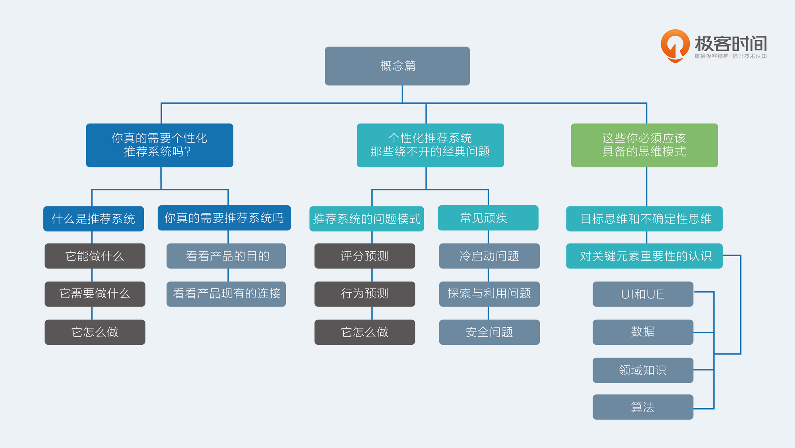

T模型方面主要看看 深度学习的 流行的模型https://www.jianshu.com/u/c5df9e229a67 这个博客不错，有个叫王喆的写了一本书 深度学习推荐系统

广告方面的推荐系统，可以看看腾讯和facebook的论文，lookalike等

工具，模型训练主要是tensorflow，高阶api 可以用 keras、pytorch，正经学的话还是tf基础先看看；数据方面，在线一般是flink，离线spark+hive 比较多;

需要了解的相关知识，用户画像（用户纬度特征），特征工程常用的方法，内容解析（主要是对商品和资讯内容，解析文本特征，类别、关键词等）

# 判断是否需要建立一个推荐系统

$\frac {增加的连接数} {增加的用户数*增加的有效物品数}$

如果增加的连接数主要靠增加用户和增加物品，则该值会较低，不适合建立一个推荐系统。

如果增加的连接数和新增用户和物品关系不大，则说明连接数已经有自发生长的趋势，适合加入推荐系统推动这一状态。

# 什么是推荐系统

回答以下三个问题，你便知道什么是推荐系统

- 它能做什么
- 它需要什么
- 它怎么做

**推荐系统能做什么**

推荐系统可以把那些最终会在用户（User）和物品（Item） 之间产生的连接提前找出来。

连接：能够产生关系的都是连接。比如点击行为，消费行为。

**推荐系统需要什么** 推荐系统需要已有的连接，来预测未来的连接

**推荐系统怎么做** 用已有的连接去预测用户和商品未来会出现的连接

# 推荐系统类别

从达成目标的角度看，可以分为两大类： - 评分预测 - 行为预测

## 评分预测

假如用户消费完一个物品之后会给出一个打分，比如通常是 1~5。然后根找出那些他可能会打高分但是没消费过的物品，将其呈现给用户，用户体验就会更高了。

Netflix 比赛的评判标准就是 RMSE ，即均方根误差

$$RMSE=\sqrt {\frac {\sum_{i=1}^n(\hat y_i-y_i)^2}{n}}$$

评分预测有以下缺点： - 数据不易收集，必须等用户消费过产品之后才有可能获取到 - 数据质量不能保证，伪造评分成本低 - 评分的分布不稳定，整体评分会在不同时间会差异很大，个人在不同时间段评分标准也会不同，人和人的标准也不一样

## 行为预测

隐式反馈数据比显示的评分数据要多得多。

预测行为的方式有很多，常见有两种： - 直接预测行为本身发生的概率(CTR估计，click through rate，点击率) - 预测物品的相对排序

行为预测，就是利用隐式反馈数据来预测隐式反馈的发生概率。

隐式反馈的优点： - 数据比显示反馈更稠密 - 隐式反馈更代表用户的想法 - 隐式反馈常常和模型的目标函数更密切，因此更容易在AB测试中和测试指标挂钩。比如CTR预估关注的就是点击这个隐式反馈

行为预测能解决推荐系统80%的问题，评分预测解决最后的20%。

# 推荐系统的几大弊端

- 冷启动问题
- 探索与利用问题
- 安全问题

# 推荐系统产品的四大关键元素

- UI和UE：人机交互、用户体验
- 数据：充足的历史积累数据
- 领域知识：常识和通识。比如音乐领域，一个歌手的死忠粉，你推荐给他该歌手的任意一首歌对他来说都是徒劳——因为他早就听过了。
- 算法

他们的重要性依次递减，权重大致是 4-3-2-1

这四个元素，都不是“天亮以后说分手”的那种，而是需要长期陪伴，不断打磨。这里阐明其重要性的高低，是为了让你在资源有限，精力很少的前提下抓大放小。

# 做好一个推荐系统的步骤

1、认识每一个用户（用户画像）

2、给他推荐他感兴趣的东西

3、坐等各个指标上升

# 用户画像

## 什么是用户画像

User Profile。原本用于营销领域。营销人员对客户有更精准的认识，从而针对性地对客户和市场指定营销策略。

推荐系统在预测前，需要将用户和物品向量化。将用户向量化的过程，就是用户画像。

## 用户画像的关键因素

- 维度
- 量化

用户画像是跟着使用效果走的，用户画像本身并不是目的。

## 怎么构建用户画像

- 查户口：直接使用原始数据作为用户画像的内容，如性别，年龄等
- 堆数据：堆积历史数据，做统计工作，如常见的感兴趣标签，就是从历史数据中挖掘出标签，然后在标签维度上做数据统计，用统计结果作为量化结果。这是最常见的炫酷用户画像
- 黑盒子：用算法学习出无法直接解释的向量，比如使用矩阵分解得到的隐因子，或者使用深度学习模型学习用户的 Embedding 向量。这一类用户画像数据因为通常是不可解释，不能直接被人看懂。但实际上在推荐系统中承担的作用非常大

# 从文本到用户画像

要用物品和用户的文本信息构建出一个基础版本的用户画像，大致需要做这些事： - 非结构化数据结构化，去粗取精，保留关键信息 - 根据用户的行为数据，把物品的结构化结果传递给用户，与用户自己的结构化信息合并

## 结构化文本

- 关键词提取
    - TF-IDF、TextRank
- 实体识别：人物、位置和地点等，常用基于词典的方法结合CRF模型
- 内容分类：将文本按照分类体系分类，用分类表达较粗粒度的结构化信息
- 文本：在无人制定分类体系的情况下，无监督的将文本划分成多个簇
- 主题模型：从大量文本中学习主题向量，然后再预测新的文本在各个主体上的概率分布情况。
- 嵌入embedding。嵌入表达是为了挖掘出字面意思之下的语义信息，并且用有限的维度表达出来

### TF-IDF

### TextRank

### 内容分类

在门户网站时代，每个门户网站都有自己的频道体系。这是一个非常大的内容分类体系。图文信息内容被自动分类到不同的频道中，从而能够得到最粗粒度的结构化信息，也被很多推荐系统用来在用户冷启动时探索用户兴趣。

以前长文本比较多，容易分类。现在短文本多，分类方面的经典算法是SVM，工具上最常见的是Facebook开源的FastText

### 实体识别

### 聚类

### 词嵌入

##